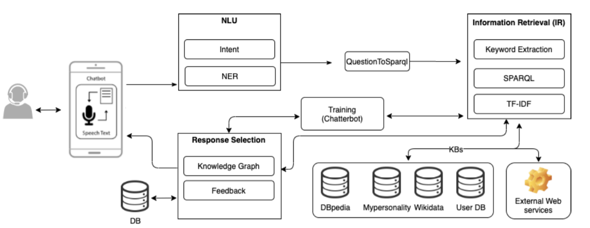
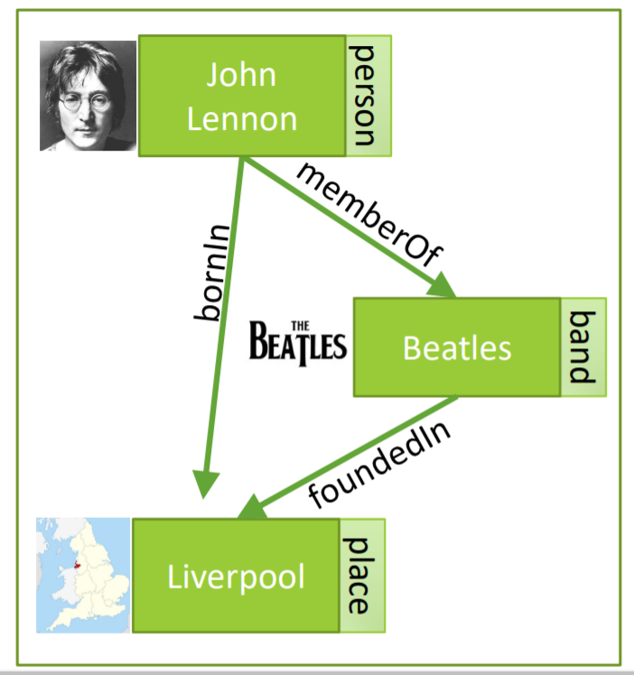
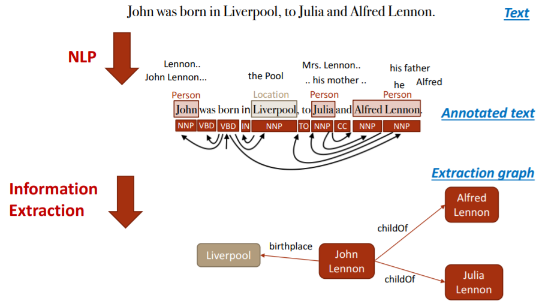
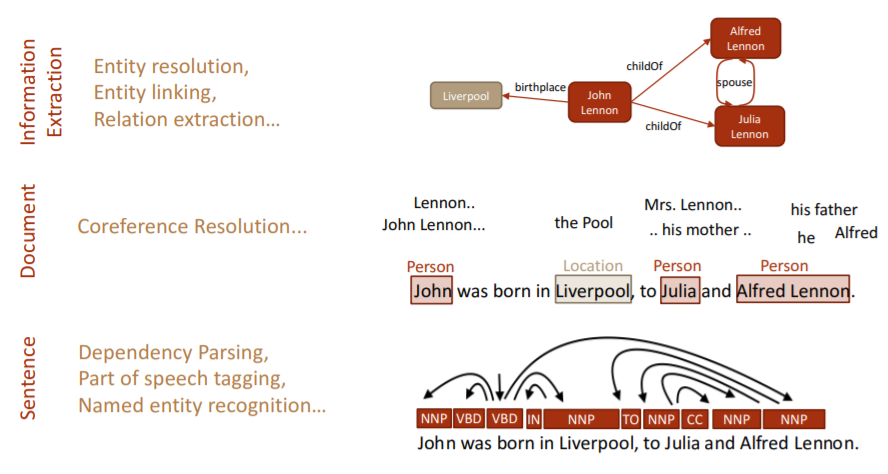

# Knowledge Graph based Chatbot
A general pipeline is shown below.

## 1. Knowledge Graphs:
 * They simply store knowledge in graph form.
 * Capture entities, attributes and relationship from structured as well as unstructured data.
 * Nodes are entities, which are labelled with attributes and the edges b/w 2 nodes capture relationship b/w entities.
  
 * The Knowledge can come from any source be it, wikipedia, tables, news, social media, images etc.
 * Most implementations use RDF triples like:
   * <rdf:subject, rdf:predicate, rdf:object> : r(s,p,o)
 * Major weakness to KGs is Knowledge acquisition.

### 1.1 Knowledge Extraction

 * Bottom up Approach of KE:

 * For this project, NER, POS tagging and Dependency Parsing along with Coreference Resolution were used to filter out usable triplets from NCERT K-10 to K-12 text and scraped wikipedia text on electricity topic only.

 * ### Knowledge Graph Creation:
1.  AristoKB can be downloaded from [here](https://allenai.org/data/tuple-kb)
2.  Code for creating Knowledge Graph using networkx is [here](https://colab.research.google.com/drive/1YUiYhv534F9O1XppNNG_E298G_JvV6Ql?usp=sharing) 
3.  Code for scraping wikipedia data is [here](https://colab.research.google.com/drive/1uih0vyQGkZjU_qtytUZ8LgMEudFzVpB0?usp=sharing)
4.  Knowledge Graph created from NCERT cleaned data is [here](https://colab.research.google.com/drive/1Dlrs28XnXkA2hnncCTOPEDqjkwq2sUT3?usp=sharing) 

## Haystack Code Notebooks:
1. Main Chabot with fine-tuned reader [here](https://colab.research.google.com/drive/1VFlaUXieZlTPgEMmrf-5hRFg5QY5aMfR?usp=sharing)
2. Fine-tuning on Internal datset [here](https://colab.research.google.com/drive/1pPqTiewEdMIuPlPzhbIw4cwVeVn9KDKR?usp=sharing)

**Google Drive link for Fine-tuned readers (distill-bert and albert)**: [here](https://drive.google.com/drive/folders/1L1sOu9n0MXn_n7mo-ndnxUJF8VshaC7Y?usp=sharing)
